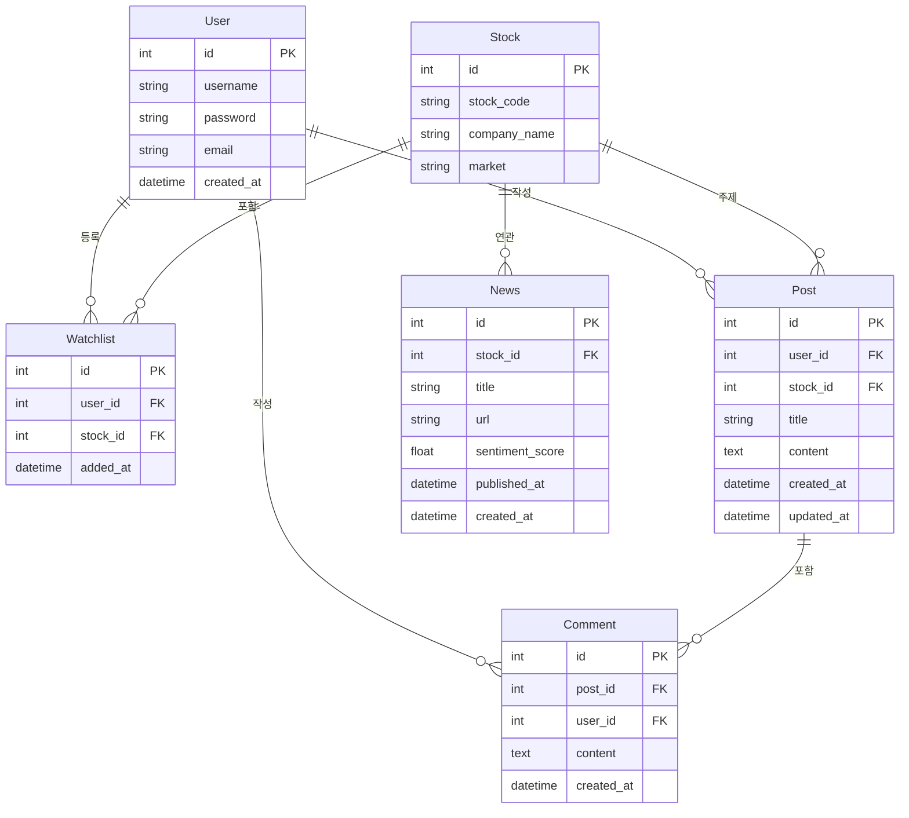

### 데이터베이스 구조 (ERD)

```mermaid
erDiagram
    User ||--o{ Watchlist : "등록"
    User ||--o{ Post : "작성"
    User ||--o{ Comment : "작성"
    Stock ||--o{ Watchlist : "포함"
    Stock ||--o{ News : "연관"
    Stock ||--o{ Post : "주제"
    Post ||--o{ Comment : "포함"

    User {
        int id PK
        string username
        string password
        string email
        datetime created_at
    }

    Stock {
        int id PK
        string stock_code
        string company_name
        string market
    }

    News {
        int id PK
        int stock_id FK
        string title
        string url
        float sentiment_score
        datetime published_at
        datetime created_at
    }

    Watchlist {
        int id PK
        int user_id FK
        int stock_id FK
        datetime added_at
    }

    Post {
        int id PK
        int user_id FK
        int stock_id FK
        string title
        text content
        datetime created_at
        datetime updated_at
    }

    Comment {
        int id PK
        int post_id FK
        int user_id FK
        text content
        datetime created_at
    }
```